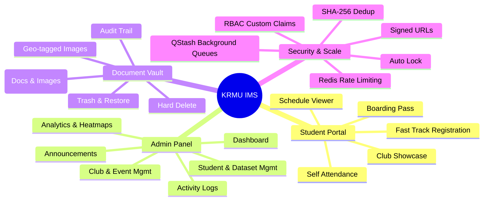
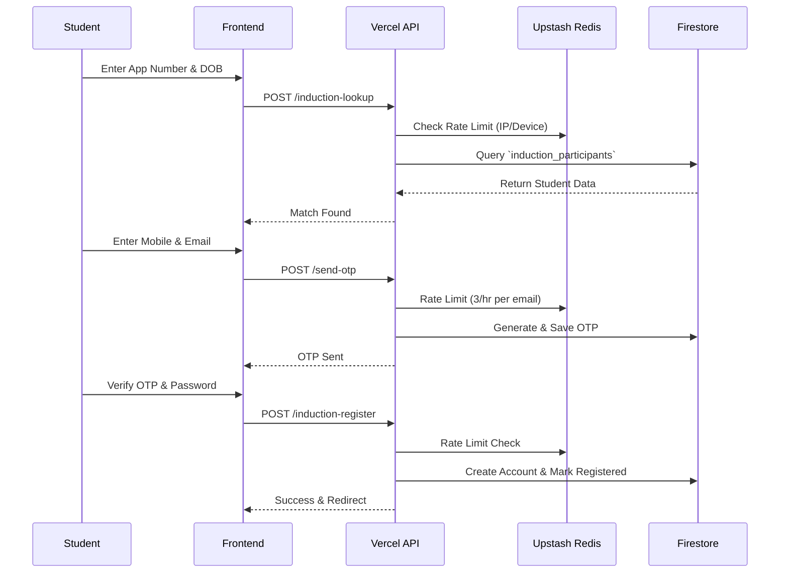
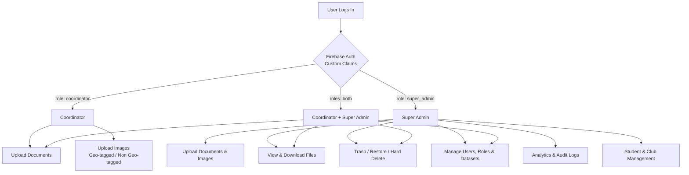
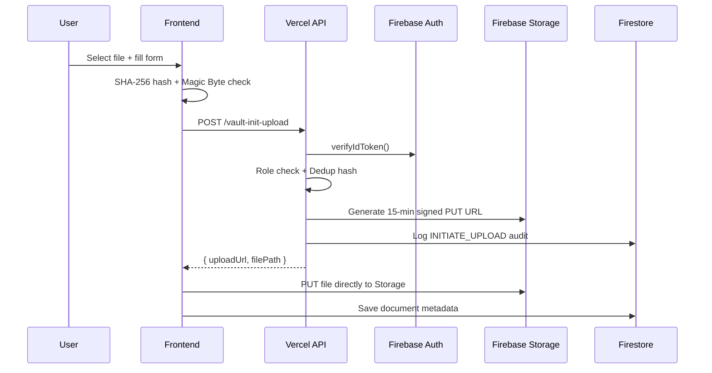
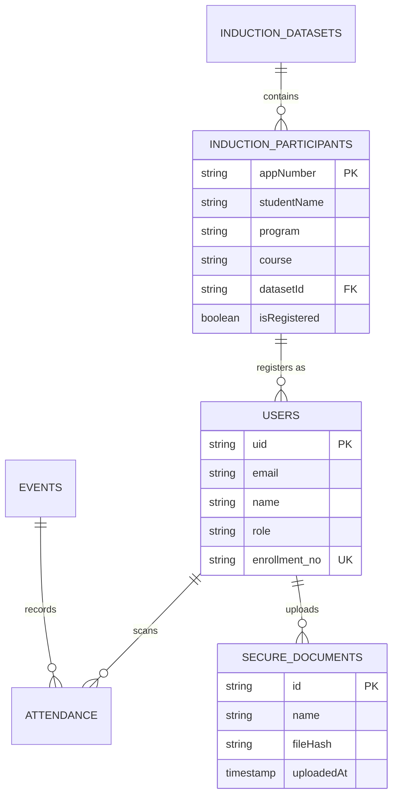
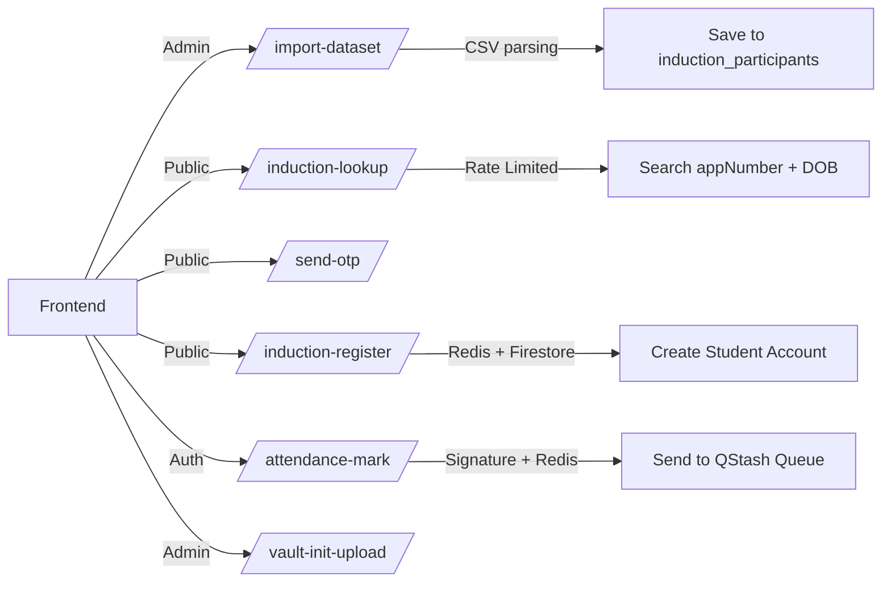
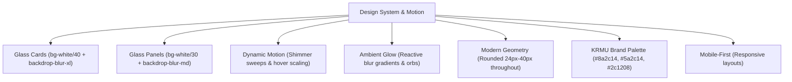

# KRMU Induction Management System

A web app for managing university induction events at K.R. Mangalam University (KRMU). It handles QR-based attendance, document management, fast-track registration, analytics, and coordinator access. Runs on a highly scalable serverless Vercel + Firebase stack.

Supports **10,000+ concurrent students** with role-based auth, Redis-backed rate limiting, QStash background queuing, and signed URL document security.

---

## Features

---

## Tech Stack

| Layer | Technology | Purpose |
| :--- | :--- | :--- |
| Framework | TanStack Start (React 19 + TypeScript) | Full-stack SSR and routing |
| Styling | Tailwind CSS v4 | Utility CSS |
| Animations | Framer Motion | Transitions and animations |
| UI Components | Shadcn/UI + Radix UI | Headless component library |
| Database & Auth | Firebase Firestore + Firebase Auth | Database and custom claims RBAC |
| File Storage | Firebase Storage (Blaze Plan) | File hosting with signed URLs |
| Security | Upstash Redis | Rate limiting, nonce tracking, IP protection |
| Queuing | Upstash QStash | Background job processing for high concurrency |
| Backend APIs | Vercel Serverless Functions | Auth, upload, registration, and attendance logic |

---

## High Concurrency & Mobile

The app is built for mobile so students can register or mark attendance on their phones, even when thousands connect simultaneously.

- **Serverless Scaling:** Vercel Edge functions instantly scale to handle 10,000+ concurrent hits.
- **Queued Writes:** Upstash QStash buffers database writes to prevent Firebase from crashing during massive QR scanning waves.
- **DDoS Protection:** Upstash Redis blocks bots and spam requests at the edge.
- **Responsive UI:** Scaled hero text, adaptive grids, fluid container padding, and oversized touch targets for mobile.
- **Performance:** GPU-accelerated CSS animations, lazy-loaded chunks, and highly optimized bundle sizes.

---

## Fast Track Registration Flow

---

## Attendance Security & Scale (v4)

QR codes are generated server-side only and never sent to the student client. Each QR is signed with HMAC-SHA256 and rotates every 30 seconds.

When 10,000 students scan a QR code simultaneously, the system uses a **Queue-Based Architecture**:

1. **Edge Validation:** Vercel checks the QR signature, expiry, and student session.
2. **Redis Bouncer:** Upstash Redis checks rate limits (5 scans/min) and blocks duplicate scans instantly in memory.
3. **QStash Handoff:** Instead of waiting for Firestore to save the record, Vercel sends the verified scan to Upstash QStash.
4. **Instant Response:** The student instantly sees a "Success" checkmark on their phone.
5. **Background Processing:** QStash safely delivers the records to Firebase at a manageable speed, updating the database and awarding points without any database locking or crashing.

---

## Role-Based Access Control

---

## Document Vault Security Flow

---

## Firestore Data Model

---

## API Overview

---

## Design System

Glass aesthetic with interactive animations.

---

## License

Proprietary software built for K.R. Mangalam University internal use.
© 2026 KRMU. All rights reserved.

