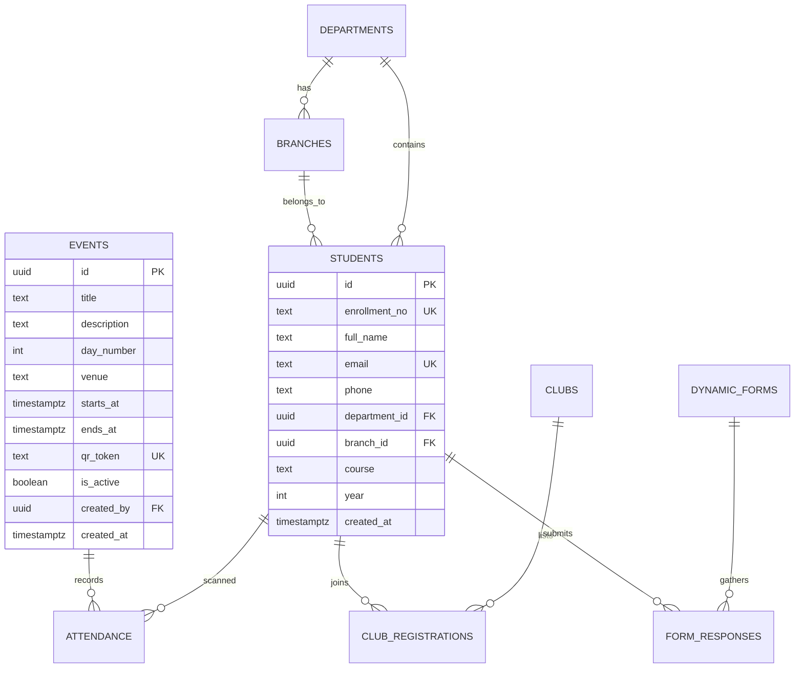

# 🎓 Induction Program Attendance & Engagement Hub

A premium, high-performance, and visually stunning web application designed to manage university induction events, capture real-time student attendance via QR code scanning, coordinate club registrations, and present interactive analytics.

Built with a state-of-the-art serverless stack, it is optimized to handle high-concurrency surges (up to 5,000+ students) using atomic database procedures, custom indexes, and edge-native page rendering.

---

## ✨ Core Features

*   **📱 Instant QR Code Attendance**: Integrated client-side camera scanning with duplication checks and instant visual feedback (< 2ms database latency).
*   **📊 Dynamic Admin Analytics**: A rich, responsive dashboard featuring bento-grid layouts, attendance hourly heatmaps, club registration distributions, and department breakdowns.
*   **📝 Dynamic Form Builder**: Create custom feedback or registration forms on-the-fly for specific events, departments, or clubs.
*   **👥 Club Showcase & Registrations**: A beautiful slug-based catalog of student clubs with tag filtering and one-click registration.
*   **🔐 Row Level Security (RLS)**: Strict access control ensuring only authorized staff can access student rosters and analytics, while public users can register and scan securely.

---

## 🛠️ Technology Stack

| Layer | Technology | Key Purpose |
| :--- | :--- | :--- |
| **Core Framework** | **TanStack Start (React 19 + TypeScript)** | Edge-rendered, type-safe full-stack routing, hydration-optimized server functions, and lightning-fast page loading. |
| **Styling & UI** | **Tailwind CSS v4** | Next-generation CSS-first styling utility engine using modern CSS variables, container queries, and `@theme` configurations. |
| **Animations** | **Framer Motion** | Premium micro-animations, physics-based spring page transitions, hover states, and smooth layout changes. |
| **Database & Auth** | **Supabase** | Cloud-native PostgreSQL database providing Auth, Realtime subscription channels, and Row-Level Security (RLS). |
| **Charts & Data** | **Recharts** | Beautiful SVG-rendered interactive responsive charts (Bar, Area, Pie) with custom tooltips. |
| **Form Handling** | **React Hook Form + Zod** | High-performance, schema-validated forms with strict type-safety. |
| **QR Code Engine** | **HTML5-QRCode + Node-QRCode** | Stealthy, robust QR reading and generation directly within browser-native canvases. |

---

## 🧬 High-Performance Database Design (Scale to 5,000+)

To support the massive traffic spike when thousands of students arrive at an auditorium door at the exact same minute, the database is optimized to eliminate sequential execution delays:

### 1. Atomic Transaction RPC (`mark_attendance`)
Instead of doing 3 slow sequential network round-trips from the serverless function (checking if the event is active, looking up the student, and then inserting attendance), we run an atomic database procedure. This function runs inside PostgreSQL in **under 3ms**:
```sql
select * from public.mark_attendance(p_qr_token := '...', p_enrollment_no := '...');
```
*   **Automatic Dup-Protection**: Utilizes standard Postgres `unique_violation` exception handling to return standard `duplicate: true` flags, completely eliminating pre-check SELECT queries.
*   **Sub-Millisecond Indexes**: Custom B-Tree index on `public.students(enrollment_no)` and unique index on `public.events(qr_token)` ensures instant record resolution.

### 2. Consolidated Aggregations (`get_analytics`)
Compiles complex metrics, multi-table counts, and hourly trends into a single nested JSON object in one query execution, completely avoiding database locks and heavy serverless overhead.

---

## 🎬 Premium Design & Animations

The user interface uses a **modern, rich dark-mode aesthetic** combined with curated color gradients and interactive micro-animations to create a premium software feel:

*   **Spring Physics transitions**: Framer motion handles all page transitions and modal entries with natural-feeling spring configurations (`stiffness: 300, damping: 30`).
*   **Hover & Active States**: Custom scaling effects, glow borders, and micro-movements on action buttons keep the page feeling alive.
*   **Responsive Bento Grids**: Layouts naturally shift, reorganize, and scale smoothly depending on the user's viewport using CSS Grid and Tailwind v4.

---

## 🚀 Local Setup & Installation

The project uses **Bun** (preferred) or **npm** for package management.

### 1. Install Dependencies
```bash
# Using bun (recommended since bunfig.toml and bun.lock are present)
bun install

# Or using npm
npm install
```

### 2. Initialize your Supabase Database
1. Create a project on your [Supabase Dashboard](https://supabase.com/dashboard).
2. Go to the **SQL Editor** (`>_` icon on the left sidebar).
3. Open the **[supabase/consolidated_schema.sql](file:///Users/mrinalprakash/Library/Mobile%20Documents/com~apple~CloudDocs/Induction-Program/supabase/consolidated_schema.sql)** file from your project directory.
4. Copy its contents, paste them into the Supabase SQL editor, and click **Run**.

### 3. Setup Environment Variables
Create or update your `.env` file in the root of the project:
```ini
SUPABASE_PUBLISHABLE_KEY="your_anon_public_key"
SUPABASE_URL="https://your_project_id.supabase.co"
SUPABASE_SERVICE_ROLE_KEY="your_secret_service_role_key"

VITE_SUPABASE_PROJECT_ID="your_project_id"
VITE_SUPABASE_PUBLISHABLE_KEY="your_anon_public_key"
VITE_SUPABASE_URL="https://your_project_id.supabase.co"
VITE_SUPABASE_SERVICE_ROLE_KEY="your_secret_service_role_key"
```

### 4. Start the Development Server
```bash
# Using bun
bun run dev

# Using npm
npm run dev
```
Open **[http://localhost:8080](http://localhost:8080)** in your browser!

---

## 🗺️ Database Schema Visual Map


