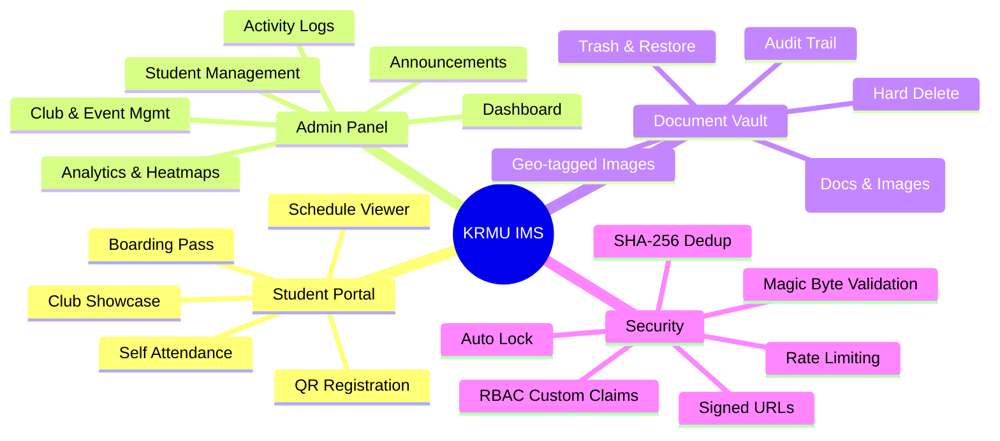
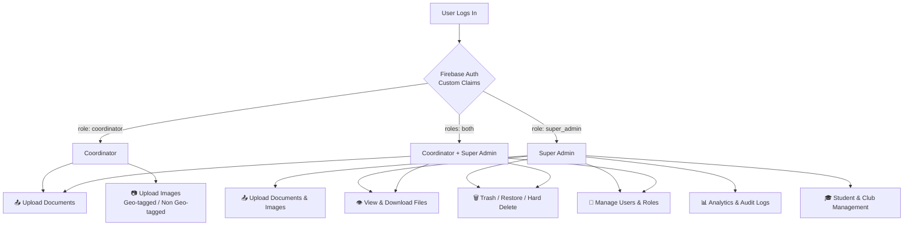
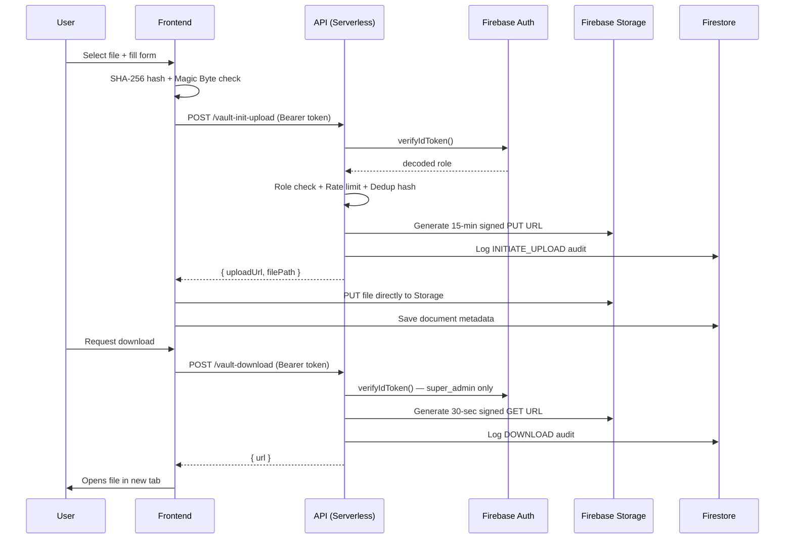
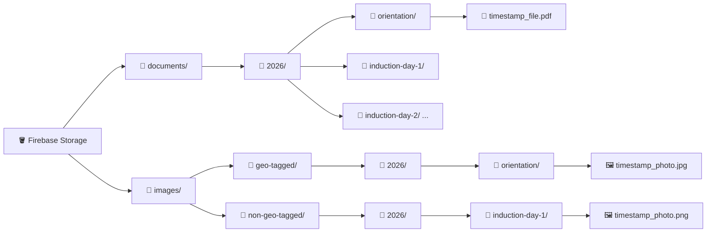
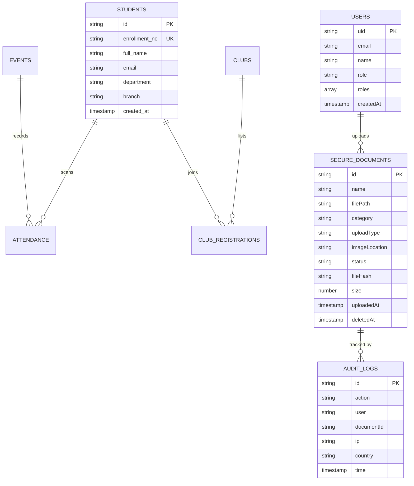
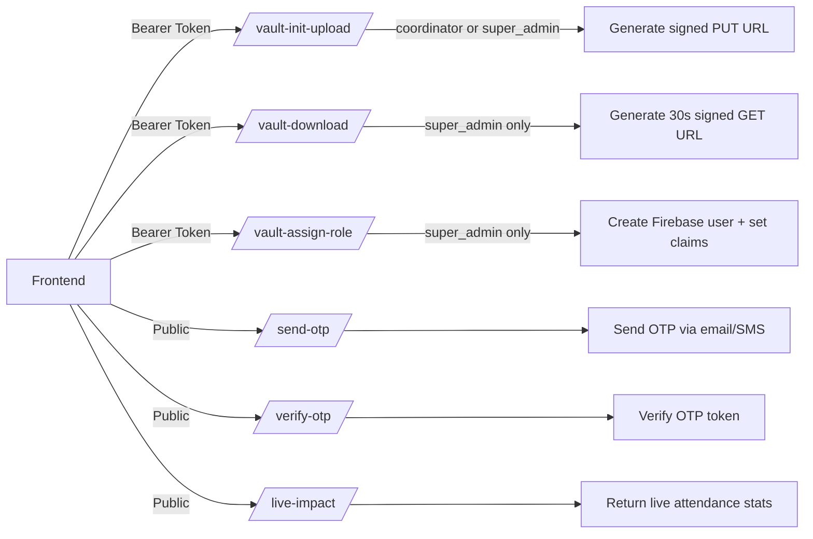
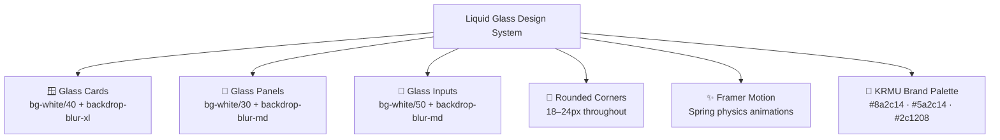

# 🎓 KRMU Induction Management System

A **premium, enterprise-grade** web application built to manage university induction events at scale. Designed for **KRMU (K.R. Mangalam University)**, it handles real-time student attendance via QR scanning, secure document management, club registrations, analytics, and coordinator management — all backed by a serverless Firebase stack.

Built to handle **5,000+ concurrent students** with a Liquid Glass UI, RBAC authentication, signed URL document security, and a full audit trail.

---

## ✨ Feature Overview!



---

## 🛠️ Technology Stack

| Layer | Technology | Purpose |
| :--- | :--- | :--- |
| **Framework** | TanStack Start (React 19 + TypeScript) | Full-stack SSR, type-safe routing |
| **Styling** | Tailwind CSS v4 | CSS-first utility engine |
| **Animations** | Framer Motion | Spring transitions, micro-animations |
| **UI Components** | Shadcn/UI + Radix UI | Accessible, headless component library |
| **Database & Auth** | Firebase Firestore + Firebase Auth | Real-time database, custom claims RBAC |
| **File Storage** | Firebase Storage (Blaze Plan) | Secure file hosting with signed URLs |
| **Backend APIs** | Vercel Serverless Functions (TypeScript) | Auth, upload, download, role management |
| **Charts** | Recharts | Responsive SVG charts |
| **QR Engine** | HTML5-QRCode | Camera-based QR scanning |

---

## 🔑 Role-Based Access Control



---

## 🗄️ Document Vault — Security Flow



---

## 🗂️ Storage Architecture



---

## 🏛️ Firestore Data Model



---

## 📡 API Overview



---

## 🎨 Design System — Liquid Glass

The entire admin panel uses a **Liquid Glass** aesthetic inspired by Apple's modern UI:



---

## 🚀 Local Setup

```bash
git clone https://github.com/MRINALPRAKASHFSD/Induction-Program.git
cd Induction-Program
npm install
npm run dev
```

> ⚙️ Requires Firebase project credentials and a Blaze plan Storage bucket. Contact the system administrator for access.

---

## 📄 License

This project is proprietary software built for **K.R. Mangalam University** internal use.  
© 2026 KRMU. All rights reserved.
