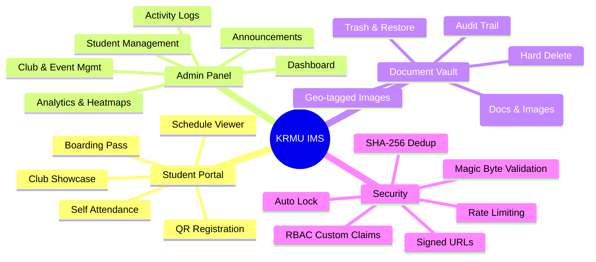
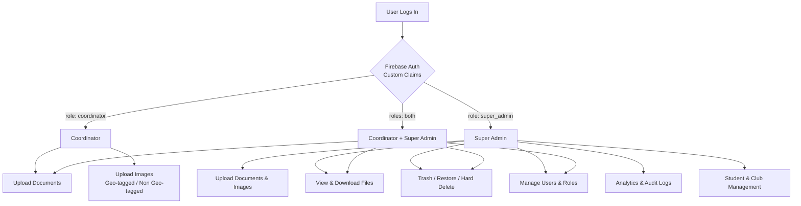
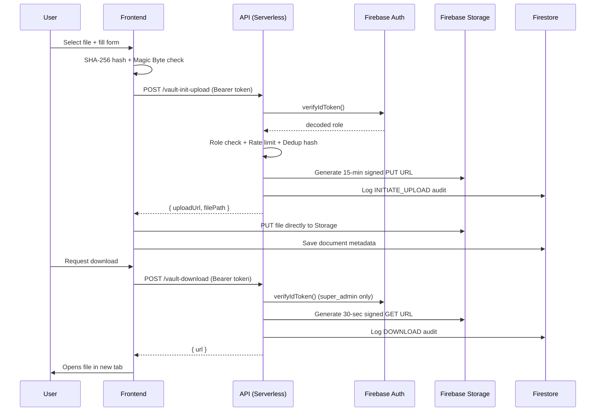
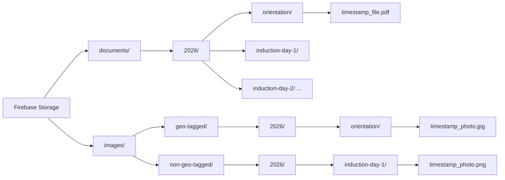
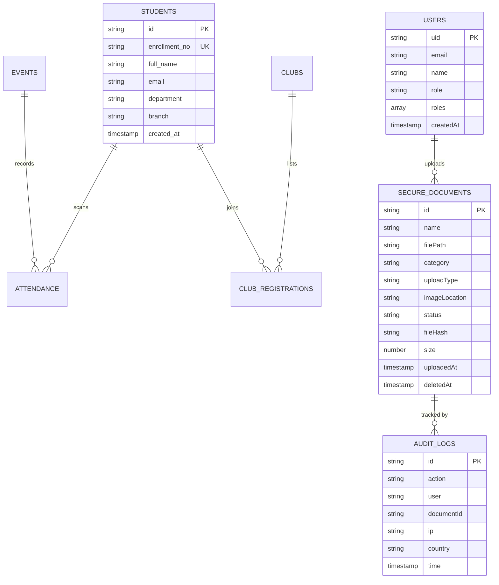
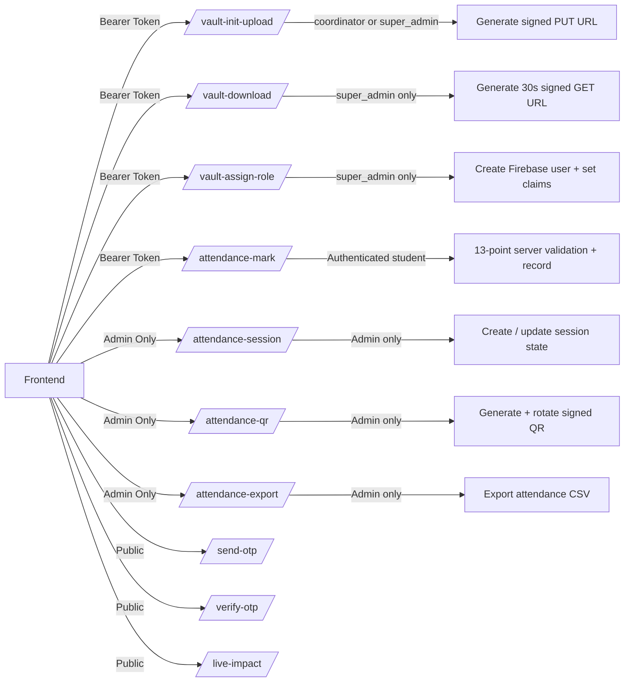
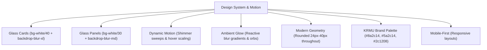

# KRMU Induction Management System

A web app for managing university induction events at K.R. Mangalam University (KRMU). It handles QR-based attendance, document management, club registrations, analytics, and coordinator access. Runs on a serverless Firebase stack.

Supports up to 5,000 concurrent students with role-based auth, signed URL document security, and a full audit trail.

---

## Features

---

## Tech Stack

| Layer | Technology | Purpose |
| :--- | :--- | :--- |
| Framework | TanStack Start (React 19 + TypeScript) | Full-stack SSR and routing |
| Styling | Tailwind CSS v4 | Utility CSS |
| Animations | Framer Motion | Transitions and animations |
| UI Components | Shadcn/UI + Radix UI | Headless component library |
| Database & Auth | Firebase Firestore + Firebase Auth | Database and custom claims RBAC |
| File Storage | Firebase Storage (Blaze Plan) | File hosting with signed URLs |
| Backend APIs | Vercel Serverless Functions (TypeScript) | Auth, upload, download, and role management |
| Charts | Recharts | SVG charts |
| QR Engine | HTML5-QRCode | Camera-based QR scanning |

---

## Mobile

The app is built for mobile so students can register or mark attendance on their phones.

- **Responsive layouts:** Scaled hero text, adaptive grids, and fluid container padding.
- **Touch controls:** Full-width buttons, oversized touch targets, and dynamic dropdown widths.
- **Performance:** 95+ desktop and 85-90+ mobile Lighthouse scores via lazy-loaded admin chunks, WebP images, preloaded fonts, and GPU-accelerated CSS animations.
- **Vercel API:** ESM (.js extensions) and glob routing support.

---

## Role-Based Access Control

---

## Attendance Security (v3)

QR codes are generated server-side only and never sent to the student client. Each QR is signed with HMAC-SHA256 and rotates every 30 seconds.

Every scan goes through 13 server-side checks:

1. Firebase JWT auth
2. Rate limiting (Redis, 5 req/min)
3. QR payload structure
4. HMAC-SHA256 signature
5. QR expiry (rotation window)
6. Nonce single-use (Redis SETNX, atomic)
7. Session is active
8. Student is registered
9. Account not suspended
10. Programme match
11. Duplicate scan (Redis + Firestore)
12. Geofence (250m campus radius, 40m GPS tolerance)

Each attendance record stores a full audit log: IP, browser, OS, GPS coordinates, distance from campus, QR nonce, and request ID. Admins can view this. Students cannot.

---

## Document Vault Security Flow

---

## Storage Layout

---

## Firestore Data Model

---

## API Overview

---

## Design System

Glass aesthetic with interactive animations.

---

## License

Proprietary software built for K.R. Mangalam University internal use.
© 2026 KRMU. All rights reserved.
